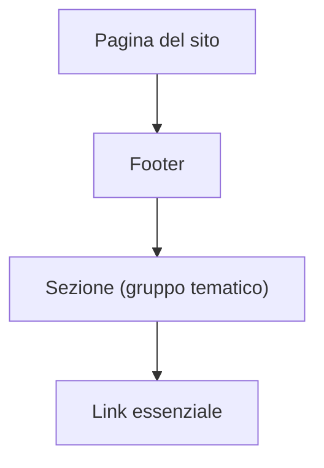

## 1. Product Overview
Migliorare il footer del sito rendendolo più leggibile e “leggero”: meno elementi, più gerarchia visiva e più spazio bianco.
L’intervento deve mantenere l’identità grafica esistente e non deve cambiare il layout generale della pagina.

## 2. Core Features

### 2.1 Feature Module
Il prodotto richiede le seguenti pagine principali:
1. **Pagina del sito (layout esistente)**: contenuto principale invariato, footer migliorato con sezioni chiare, gerarchia e spazio bianco.

### 2.3 Page Details
| Page Name | Module Name | Feature description |
|-----------|-------------|---------------------|
| Pagina del sito (layout esistente) | Vincoli di intervento | Preservare layout generale della pagina (struttura e posizionamento delle macro-aree invariati). Mantenere identità grafica (colori, font, stile). |
| Pagina del sito (layout esistente) | Riduzione elementi | Ridurre il numero di link/elementi visibili nel footer, mantenendo solo quelli essenziali. Consolidare contenuti duplicati o ridondanti. |
| Pagina del sito (layout esistente) | Gerarchia visiva | Introdurre una gerarchia chiara: titoli di sezione evidenti, gruppi coerenti, differenza netta tra titoli e link. Evidenziare i “link principali” rispetto a quelli secondari. |
| Pagina del sito (layout esistente) | Sezioni chiare | Organizzare il footer in sezioni riconoscibili e separate (es. gruppi tematici), con delimitazione visiva minima (spaziatura, allineamenti, eventualmente linee sottili). |
| Pagina del sito (layout esistente) | Spazio bianco / densità | Aumentare padding e spaziature tra blocchi, righe e colonne per migliorare scansione e leggibilità. Evitare muri di testo/link. |
| Pagina del sito (layout esistente) | Usabilità e accessibilità | Garantire contrasto adeguato, stati hover/focus chiari, aree cliccabili sufficienti. Assicurare che la struttura sia semanticamente corretta (titoli/sezioni) e navigabile da tastiera. |

## 3. Core Process
- L’utente scorre fino al footer.
- L’utente identifica rapidamente la sezione rilevante grazie ai titoli e alla spaziatura.
- L’utente seleziona un link essenziale (primario o secondario) e prosegue la navigazione.

